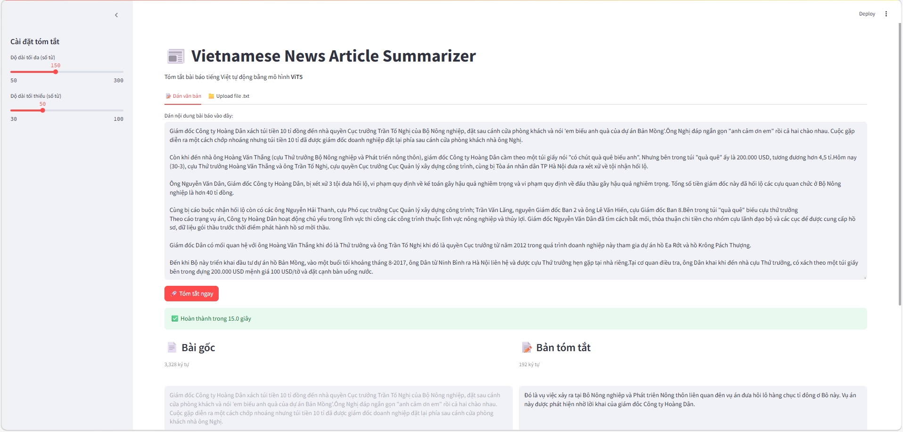
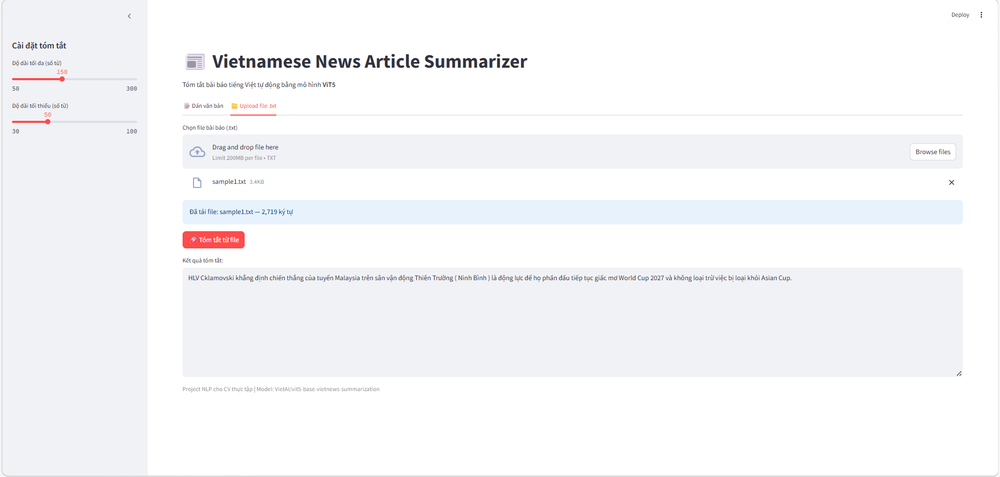

# Vietnamese News Summarizer

> A Streamlit app that automatically summarizes long Vietnamese news articles using the `VietAI/vit5-base-vietnews-summarization` model.

## Overview

This project is an end-to-end NLP mini app for abstractive summarization in Vietnamese.
Users can paste article text or upload a `.txt` file, then get a concise summary generated by a pretrained ViT5 model.

## Key Features

- Vietnamese news summarization with ViT5
- Two input modes: paste text or upload `.txt`
- Adjustable summary length (`min_length`, `max_length`)
- Clean Streamlit interface with download button for output
- Fast local inference with Hugging Face Transformers + PyTorch

## Demo

### Read Text Input


### Read from File Input


## System Architecture

```text
User Input (Text / .txt)
          |
          v
   Text Cleaning (regex)
          |
          v
Tokenization (AutoTokenizer)
          |
          v
ViT5 Seq2Seq Generation
          |
          v
   Decoded Summary Output
```

## Tech Stack

| Layer | Technology |
|---|---|
| UI | Streamlit |
| NLP Model | VietAI/vit5-base-vietnews-summarization |
| Framework | Hugging Face Transformers |
| Runtime | PyTorch |
| Language | Python |

## Project Structure

```bash
vietnamese-news-summarizer/
|-- app.py                    # Streamlit UI
|-- utils.py                  # Model loading, text cleaning, summarization
|-- sample_data/
|   |-- sample1.txt
|   `-- sample2.txt
|-- requirements.txt
`-- README.md
```

## Installation

1. Clone repository

```bash
git clone https://github.com/yourusername/vietnamese-news-summarizer.git
cd vietnamese-news-summarizer
```

2. Install dependencies

```bash
pip install -r requirements.txt
```

## Run Application

```bash
streamlit run app.py
```

## Usage Notes

- Recommended for medium-to-long Vietnamese news articles.
- First run may take longer because model files are downloaded from Hugging Face.
- Stable internet is required for first-time model download.

## Current Limitations

- No batch summarization yet
- No automatic article segmentation for very long multi-page inputs
- Quality may vary on highly noisy or non-news text

## Future Improvements

- Add batch summarization for multiple articles
- Export summary in multiple formats (`.txt`, `.md`, `.pdf`)
- Add evaluation metrics (ROUGE/BLEU) for benchmarking
- Add deploy guide (Streamlit Community Cloud / Docker)

## Author

Nguyen Nhu Toan  
Information Technology Student - Artificial Intelligence Major
